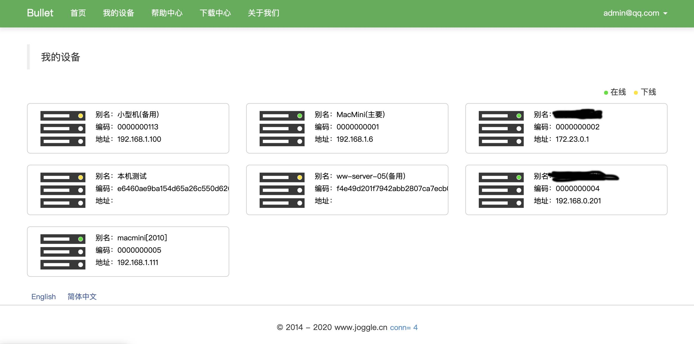
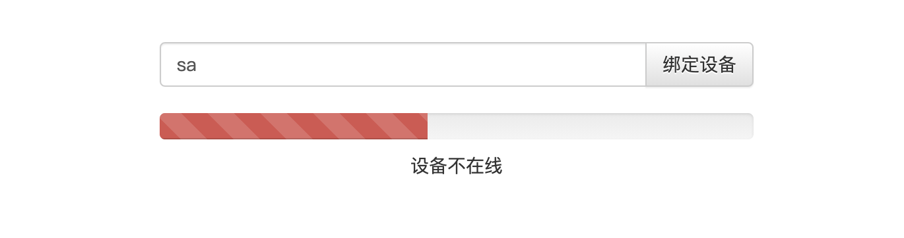
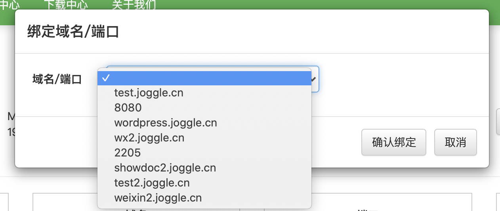

### 什么是 Bullet内网穿透？

Bullet是一款开源的反向代理内网穿透利器，采用Java技术实现了基于Websocket的Bullet内网穿透交互协议，通过自定义的协议控制Ngrok客户端实现Web界面管理。

注意：本项目对Ngrok源码定制化的修改以满足安全性等需求，所以需要使用作者提供的Ngrok源码来编译。推荐使用百度网盘编译好的ngrokd & ngrok命令。

本项目已经解决ngrok内存泄漏问题

[](https://github.com/996icu/996.ICU/blob/master/LICENSE)
[](https://996.icu)
 
 
 国内加速地址：
https://gitee.com/marker/bullet.git

介绍；
https://www.oschina.net/p/bullet-joggle

### Bullet 特性

- 支持http+https、Http、Https协议、TCP协议；
- 免费开源、灵活配置、多租户支持、多协议支持；
- TLS实现数据的安全传输；
- 断连重试机制；
- 反向代理请求；
- 远程网络唤醒（v1.2.3开始支持）；

### Bullet的管理界面


 

目前实现了Mac、linux、window、Android、ARM设备等全环境适配。

### Bullet 逻辑架构


### Bullet 项目结构


|目录 |说明|
|:---- |----   |
| build  | 构建使用的目录接口，用户DevOps流水线发布产品 |
| bullet-common  | 公共模块，包含加密、日志配置、Bullet协议、Builer结构 |
| bullet-client | Bullet客户端代理程序，主要控制Ngrok客户端协同操作| 
| bullet-server | Server端为服务端主控程序，提供系列接口供Web前端页面调用，控制Client操作Ngrok客户端| 
| bullet-codemaker | 本人比较懒，用的Mybatis-Plus生成代码| 
| databases | sql相关的（历史原因部分字段的设计采用驼峰）| 

BulletServer占用的端口说明：
|端口 |说明|
|:---- |----   |
| 8083 | Ngrok通道 |
| 80   | 代理的http端口(固定) | 
| 443  | 代理的https端口(固定) | 
| 8081 | Bullet WEB管理服务（默认端口，可通过环境变量修改) |   


### BulletClient 快速体验

首先您需要登录到平台注册一个账号，激活后您将获得一个雪花域名并赠予一个月的使用权（激活账号后才有哦）。


bullet-client的部署非常简单，百度网盘下载对应的client包
```
下载地址：https://pan.baidu.com/s/1dy2qzPtN3CmftuHGm3BJgA
密码: h9hf
```

#### 1、创建bullet文件夹
`mkdir -p /opt/bullet/`

#### 2、解压客户端压缩包
`tar -xvf bullet-client-linux.tar.gz`

树形结构如下
```
.
├── bin
│   ├── bullet
│   ├── bullet.bat
│   └── ngrok
├── conf
│   ├── cert
│   │   ├── ca.crt
│   │   └── readme.md
│   ├── config.json
│   └── ngrok.yml
├── doc
│   ├── bullet.service
│   └── http\345\215\217\350\256\256.md
└── lib
    ├── bullet-client.jar
    └── readme.txt
```

#### 3、执行 ./bin/bullet 启动客户端 输出日志有客户端编号

`./bin/bullet`

```
================================================	
================ Device NO =====================	
=== 5s4jmygyox6o ===	
================================================	
```

#### 4、登录到Bullet平台绑定设备




#### 5、将赠送的域名绑定到设备即可开启内网穿透之旅。



 
 
