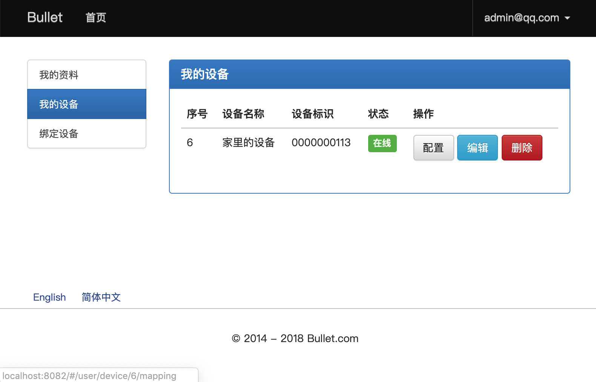
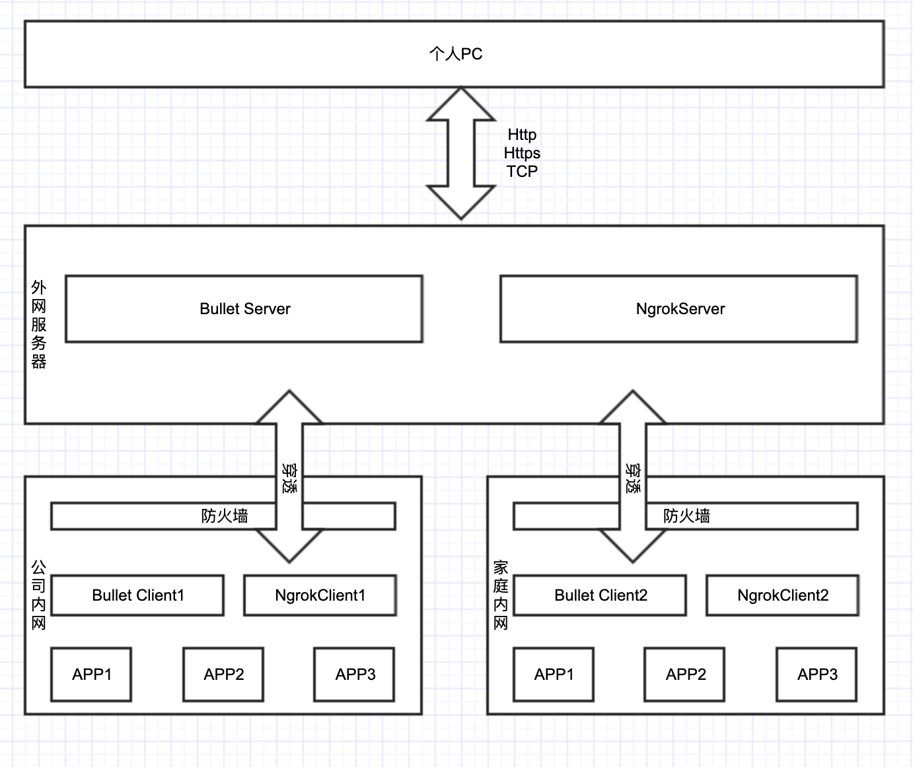

### Bullet 反向代理内网穿透服务器

基于Java实现，通过WebSocket全双工长连接技术，通过NIO接受HTTP请求，将请求信息通过WebSocket链接发送给链接的客户端。


### Bullet 特性

- 1、断连重试机制，链接断后间隔10s尝试连接；
- 2、真真意义的反向代理，长连接反向请求；
- 3、支持Http、Https协议、TCP/IP协议；
- 4、基于Ngrok实现保证请求响应数据的安全性，Ngrok内部通过rsa算法加密；



Ngrok强势入驻，由于Ngrok在内网穿透这块确实稳定，故不再造轮子，在轮子的基础上做了优化，支持Server端Web管理。

目前仅对Mac环境做了适配，需要其他环境替换bin/ngrok命令.

[](https://github.com/996icu/996.ICU/blob/master/LICENSE)
[](https://996.icu)

注意：拒绝996工作制公司请使用本项目。

### Bullet 逻辑架构





### ngrok 客户端与服务端 编译

http://www.yl-blog.com/article/608.html

本项目需要手动编译对应平台ngrok命令替换项目中的ngrok命令。


### 编译Client & Server

编译
```
mvn install
```

进入到bullet目录运行程序
```
cd Client

./bin/bullet

```

启动客户端

```
./bin/bullet
```


### 服务端安装

服务器端需要占用一个通道端口，写死在代码中的8081端口。

1、先将数据库初始化好（见databases目录中）

2、修改Server项目中的config.properties 配置文件。

3、打Springboot jar包

```
cd Server

# 打服务端包
mvn install

# 使用SpringBoot启动方式启动服务端

java -Djava.security.egd=file:/dev/./urandom -jar target/server-1.0-SNAPSHOT.jar --spring.profiles.active=dev
```

5、使用域名泛解析到服务器IP。
